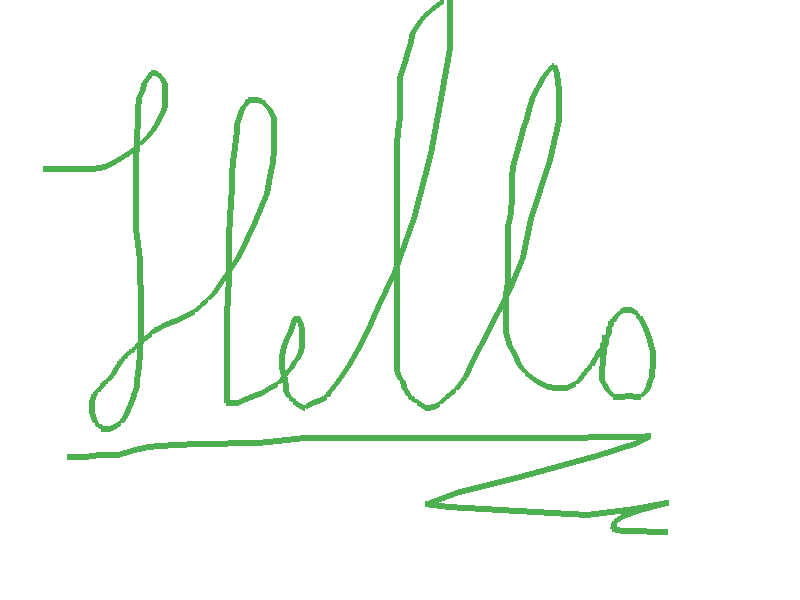

# vpaint
The extended vector drawing application directed with pygame

### How to use
- Press  and move  to draw
- Press  +  to undo changes
- Press  +  +  to redo changes
- Press  +  to save project
- Press  +  to load project

### Requirements
- `python >= 3.10`
- `pygame >= 2.0.1`
- [`pygex >= 0.1`](https://github.com/teacondemns/pygex)
